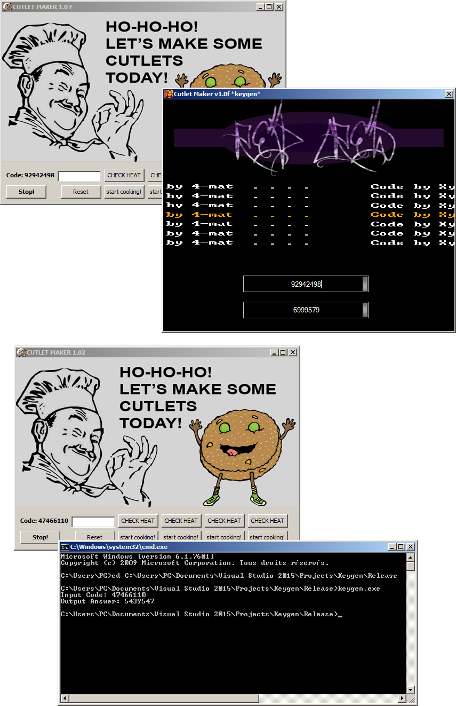

## Cutlet Maker keygen

Keygen for the ATM malware Cutlet Maker, it unlock the following versions:

cutlet maker 1.0 F (cm17F.exe)
 * [66b0d9b10c2898d388bdfd2be4a66ac76d5822f4](https://www.virustotal.com/en/file/4a340a0a95f2af5ab7f3bfe6f304154e617d0c47ce31ee8426c70b86e195320c/analysis/)

cutlet maker 1.02 (cm15.vmp.exe)
 * [8584ba9a58d90264c1ff91d7ca8710545d67b4f5](https://www.virustotal.com/en/file/c18b23cc493f89d73a2710ebb177d54beafe0edf0e17cc79e28d9efdfb69a630/analysis/)
 * [44b1eea742b63c7abc479e96c316bcd613e26ff2](https://www.virustotal.com/en/file/d1a0b2a251fa69818784e8937403c18f09b2c37eead80ba61a3edf4ac2b6b7ff/analysis/)

Console version if you are just interested by the c0decalc algorithm, scene version if you want more than just an algo.

If you are looking for a compiled version search for Cutlet.Maker.v1.0f.Keygen.only-RED.zip ([d1ae319c70661d971c70840c88fdf8314849f763](https://www.virustotal.com/en/file/d7e4c6ebdfd65bbde8f7d897c8e2653ec4e2feafd5aacb2c0aa219ee227e3e7b/analysis/))

